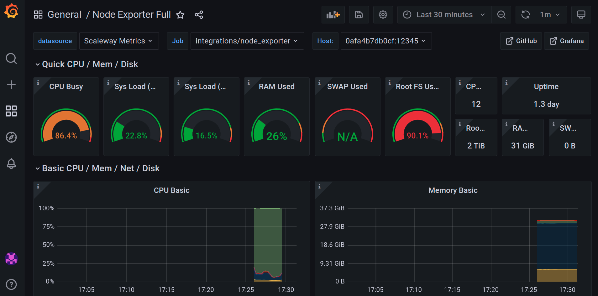

# Scaleway Observability with IaC

Experimenting Scaleway's observability feature with automation scripts.

## Presentation

:warning: Observability is currently an **alpha** feature. API might be unstable or change quickly.

> Scaleway Observability is a platform to monitor applications and their infrastructure. It ingests metrics, using a Prometheus-like API, and logs, using a Grafana Loki API. It also provides a Grafana Dashboard to visualize the metrics and logs.

## Pre-requisite

- [Ansible](https://docs.ansible.com/ansible/latest/installation_guide/intro_installation.html#pip-install) version >= `2.11.12`
- Python version >= `3.7.x`
- [Docker](https://docs.docker.com/engine/install/) version >= `19.x.x`
- [docker-compose](https://docs.docker.com/compose/install/) version >= `1.28.x`

## Getting started

In this example inspired from [the official documentation](https://developers.scaleway.com/en/products/observability/api/v1alpha1), we're going to start a Cockpit instance (observability server), push some logs or metrics from a Docker container and visualize them in Grafana.

1. Retrieve [your Scaleway credentials](https://console.scaleway.com/project/credentials) and edit the variables file

    ```bash
    cp ./vars/main.example.yml ./vars/main.yml
    ```

2. Activate Cockpit for your project and create a push token

    ```bash
    ansible-playbook -i inventories/local.ini ./observability.yml -t activation --extra-vars @./vars/main.yml
    ```

    Variables are saved in a local `./facts.json` file to use them in following use case roles.

### Use case : simple logs injection

This use case will simply push logs generated by [a random logger container](https://github.com/chentex/random-logger) to our Grafana instance.

1. Push some logs to your instance

    ```bash
    ansible-playbook -i inventories/local.ini ./observability.yml -t push-simple-logs --extra-vars @./vars/main.yml
    ```

    Your credentials will display so you can watch your logs

2. Go to the _Explore_ menu of your Grafana instance URL

    

    Stop logs injection by stopping containers :

    ```bash
    cd /tmp/scw-cockpit-demo && docker-compose down && cd -
    ```

### Use case : metrics injection

This use case will simply push metrics and logs generated by a container to our Grafana instance. CPU, memory and storage metrics are your host's.

1. Push some metrics and logs to your instance

    ```bash
    ansible-playbook -i inventories/local.ini ./observability.yml -t push-metrics-logs --extra-vars @./vars/main.yml
    ```

    Your credentials will display so you can watch your logs

2. Add _Node Exporter_ dashboard to Grafana

    1. Hover your mouse over the "+" button on the left of your screen
    2. On the menu that appeared, click on the Import item
    3. Put the `1860` [dashboard ID](https://grafana.com/grafana/dashboards/1860) in the text box and click `Load`
    4. Select the `Scaleway Metrics Prometheus` instance as the data source
    5. Click the `Import` button

3. Go to the _Node Exporter Full_ dashboard of your Grafana instance

    

    Stop logs injection by stopping containers :

    ```bash
    cd /tmp/scw-cockpit-demo && docker-compose down && cd -
    ```

## Suggestions & feedbacks for Scaleway's team

- Make it possible to filter tokens by name in addition to IDs in GET:/tokens so it is easier to browse and remove
- Make documentation's `logs.configs[0].clients.url.tenant_id` instruction example more specific (is `<your push token>` the ID, the name or the secret ?)
- Make documentation's `<* push url>` instruction example more specific
